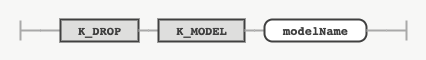

## DROP MODEL

### 목적

DROP MODEL 문은 정의되어 있는 모델을 삭제하는 데 사용한다.


### 구문

#### dropModel



### 키워드 및 파라미터

#### modelName

삭제할 모델명을 나타내는 식별자다.


### 예시

#### 모델 삭제

다음은 기존에 정의되어 있는 tablegan이라는 모델을 삭제하는 문장이다.
```console
DROP MODEL tablegan;
```
