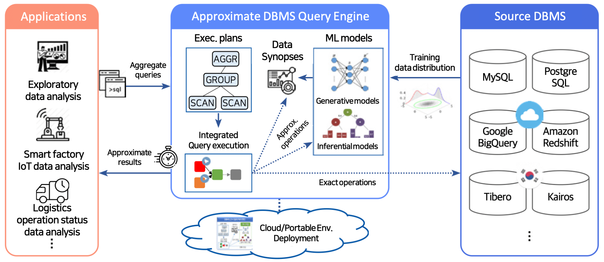

# Introduction

## What is TrainDB?

TrainDB is an ML-model based approximate DBMS query engine that provides approximate but accurate enough query results based on machine learning models in order to support exploratory data analysis for timely business decision-making.

TrainDB's key features are as follows:

- Providing approximate query results without access to base tables after ML model training
- Remote ML model training/serving with Kubeflow-based cloud ML model serving framework
- Various DBMS data sources support 

## TrainDB's Main R&D Topics

1. [TrainDB: an ML-model based approximate query processing engine](https://github.com/traindb-project/traindb)
  - SQL-like approximate query language
  - Approximate query processing using synopsis data that are synthesized by ML models
  - Approximate query processing using ML inference models
  - Various DBMS data sources support via extensible data source adapters
2. [ML model library for approximate query processing](https://github.com/traindb-project/traindb-model)
  - Synopsis generative ML models + inferential ML models
    - Synopsis generative ML models: GAN-based models(e.g., TableGAN, OCT-GAN), score-based generative models
    - Inferential ML models: mixture density networks(MDN), relational sum-product networks(RSPN)
  - Error estimation for approximate query evaluation
  - Continual learning to update base table changes
3. [Cloud ML model serving framework](https://github.com/traindb-project/traindb-ml)
  - A framework for training/serving ML models in remote GPU servers
  - Kubeflow-based ML model registry/training/serving support
4. [Visual Exploratory Data Analysis Support Tools for TrainDB](https://github.com/traindb-project/aqp-tav)
  - Approximation query result visualization for exploratory data analysis
  - Visual OLAP analysis support for multi-dimensional data analysis
