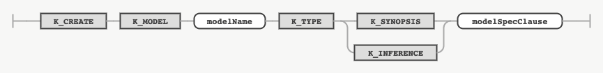
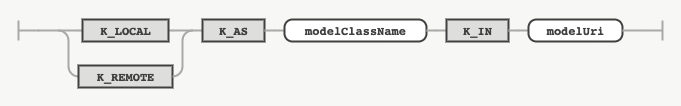

## CREATE MODEL

### 목적

CREATE MODEL 문은 모델을 정의하는 데 사용한다. 모델이란 집계 연산이 포함된 분석 질의의 근사 결과를 얻는 데 사용되는 머신 러닝 모델을 나타내는 객체이다.


### 구문

#### createModel


#### modelSpecClause



### 키워드 및 파라미터

#### SYNOPSIS

데이터 시놉시스 생성형 모델임을 지정하는 키워드다.

#### INFERENCE

근사 결과 추론형 모델임을 지정하는 키워드다.

#### modelSpecClause

모델의 세부 사항을 지정하는 절이다.

#### LOCAL

로컬 머신에 위치한 모델임을 지정하는 키워드다.

#### REMOTE

원격 머신에 위치한 모델임을 지정하는 키워드다.

#### modelClassName

modelUri 경로의 파일/서비스 내에서 모델을 나타내는 클래스명을 지정하는 식별자다.

#### 'modelUri'

로컬 모델의 경우에는 모델이 저장되어 있는 디렉토리 경로, 원격 모델의 경우에는 접속 URL을 지정하는 문자열 리터럴이다. 


### 예시

#### 로컬 모델 정의

다음은 tablegan이라는 데이터 시놉시스 생성형 로컬 모델을 'models/TableGAN.py' 디렉토리 경로에 있는 파일의 TableGAN 클래스로 정의하는 문장이다.
```console
CREATE MODEL tablegan TYPE SYNOPSIS LOCAL AS 'TableGAN' IN 'models/TableGAN.py';
```
