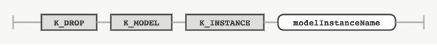

## DROP INSTANCE

### 목적

DROP MODEL INSTANCE 문은 학습되어 있는 모델 인스턴스를 삭제하는 데 사용한다.


### 구문

#### dropModelInstance



### 키워드 및 파라미터

#### modelInstanceName

삭제할 모델 인스턴스명을 나타내는 식별자다.


### 예시

#### 모델 삭제

다음은 기존에 학습되어 있는 tgan이라는 모델 인스턴스를 삭제하는 문장이다.
```console
DROP MODEL INSTANCE tgan;
```
