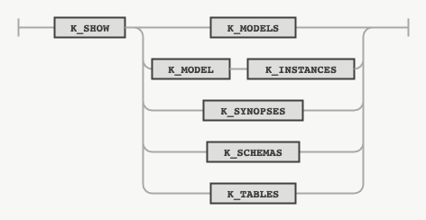

## SHOW

### 목적

SHOW 문은 모델, 모델 인스턴스, 시놉시스 등 존재하는 객체들의 정보를 조회하는 데 사용하는 구문이다.


### 구문

#### show



### 키워드 및 파라미터

#### MODELS

정의되어 있는 모델의 목록을 보여준다.

#### MODEL INSTANCES

정의되어 있는 모델 인스턴스의 목록을 보여준다.

#### SYNOPSES

생성되어 있는 시놉시스 테이블의 목록을 보여준다.

#### SCHEMAS

접속 중인 데이터 소스의 스키마 목록을 보여준다.

#### TABLES

사용 중인 현재 스키마에 속한 테이블 목록을 보여준다.


### 예시

#### 모델 조회

다음은 정의되어 있는 모델의 목록을 조회하는 문장이다.
```console
SHOW MODELS;
```

#### 모델 인스턴스 조회

다음은 학습되어 있는 모델 인스턴스의 목록을 조회하는 문장이다.
```console
SHOW MODEL INSTANCES;
```

#### 시놉시스 조회

다음은 생성되어 있는 시놉시스 테이블의 목록을 조회하는 문장이다.
```console
SHOW SYNOPSES;
```
