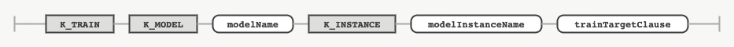

## TRAIN MODEL INSTANCE

### 목적

TRAIN MODEL INSTANCE 문은 정의한 모델을 대상 테이블의 컬럼에 대해 학습시켜 모델 인스턴스를 구축하는 데 사용한다.


### 구문

#### trainModelInstance


#### trainTargetClause


#### columnNameList


### 키워드 및 파라미터

#### modelName

학습시킬 모델명을 나타내는 식별자다.

#### modelInstanceName

모델을 학습시켜 얻은 모델 인스턴스명을 나타내는 식별자다.

#### trainTargetClause

학습시킬 대상 데이터를 지정하는 절이다.

#### schemaName

학습 대상 테이블이 포함된 스키마명을 나타내는 식별자다. 지정하지 않으면 현재 사용 중인 스키마로 지정된다.

#### tableName

학습 대상으로 지정할 테이블명을 나타내는 식별자다.

#### columnNameList

학습 대상 데이터로 지정할 컬럼 리스트를 지정한다. 컴마(,)로 구분하여 여러 컬럼을 지정할 수 있다.


### 예시

#### 모델 인스턴스 학습

다음은 정의되어 있는 tablegan이라는 모델을 instacart 스키마에 속한 order\_products 테이블의 product\_id, add\_to\_cart\_order 컬럼을 대상으로 학습시켜 tgan이라는 모델 인스턴스를 구축하는 문장이다.
```console
TRAIN MODEL tablegan INSTANCE tgan
ON instacart.order_products(product_id, add_to_cart_order);
```
